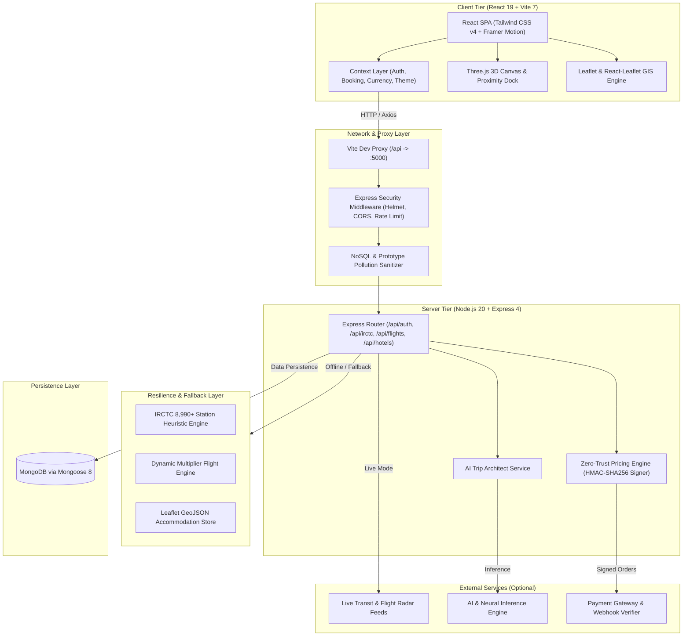
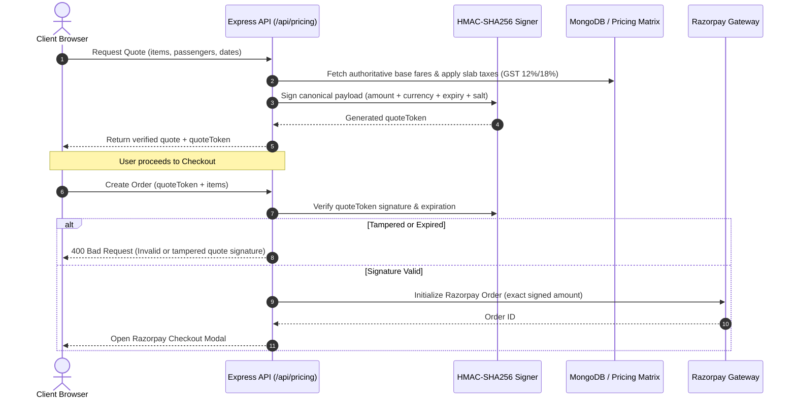

# TravelEase — System Architecture & Engineering Blueprint

This document details the architectural principles, data flows, directory organization, and design decisions behind **TravelEase**. It serves as a technical guide for developers, contributors, and systems engineers exploring or extending the codebase.

---

## 🏛️ High-Level System Topology



---

## 💎 Core Architectural Principles

### 1. Offline-First Resilience (Zero-Config Development)
Travel platforms typically require numerous external API keys (IRCTC, Amadeus, Google Places, Groq, Razorpay) which creates significant setup friction.

TravelEase solves this with an **automatic dual-mode architecture**:
- **Live Mode:** When external API keys (`RAPIDAPI_KEY`, `GROQ_API_KEY`, `RAZORPAY_KEY_ID`) are present, the server routes requests to live third-party gateways.
- **Heuristic Fallback Mode:** When external keys are omitted or rate-limited, the system automatically engages local heuristic engines:
  - An internal station database indexing 8,990+ Indian Railway stations and routes.
  - A dynamic flight fare generator factoring in distance, cabin class, and bundled return discounts.
  - A curated accommodation catalog with coordinates, amenity tags, and guest review sentiment scores.
  - Local template-based itinerary generation if Groq API is unavailable.

### 2. Zero-Trust Pricing & Financial Integrity
In modern e-commerce and travel applications, client-side fare calculation is susceptible to manipulation. TravelEase implements **authoritative server-side pricing**:



### 3. Input Sanitization & Prototype Pollution Defense
All incoming requests pass through a custom sanitization pipeline before reaching business controllers:
- Recursively strips MongoDB query selector keys starting with `$` (`$gt`, `$where`, `$regex`, `$ne`).
- Strips dotted property paths (`profile.role`) preventing unauthorized parameter binding.
- Rejects prototype pollution injection keys (`__proto__`, `constructor`, `prototype`).
- Strips non-printable ASCII control characters without breaking UTF-8 multi-lingual travel search terms.

---

## 📂 Codebase Directory Taxonomy

```text
Travel-website-main/
│
├── docs/                        # Project documentation & visual assets
│   ├── brand/                   # Official SVG logos (light, dark, mark)
│   └── screenshots/             # Production UI screenshots
│
├── src/                         # React 19 Frontend
│   ├── assets/                  # Videos, hero backgrounds, and brand imagery
│   │
│   ├── components/              # Modular UI Component Library
│   │   ├── buses/               # Bus search, seat selection, amenities
│   │   ├── common/              # Global UI: Header, Footer, Dock, AI Concierge
│   │   ├── home/                # Home sections: 3D Globe Hero, Deals, Blog preview
│   │   ├── seo/                 # Dynamic Meta tags & Schema.org JSON-LD injects
│   │   ├── trains/              # Train schedules, Tatkal countdown, PNR status
│   │   └── ui/                  # Atom-level UI: Badges, Buttons, Cards, Modals
│   │
│   ├── context/                 # Application State Management
│   │   ├── AuthContext.jsx      # User credentials, JWT storage, profile state
│   │   ├── BookingProvider.jsx  # Active booking cart, quotes, and order lifecycle
│   │   ├── ThemeProvider.jsx    # Dark / Light theme tokens & class toggle
│   │   ├── TravelContext.jsx    # Active currency, exchange rates, search params
│   │   └── index.js             # Consolidated context barrel export
│   │
│   ├── data/                    # Local mock catalogs and static airport/station lists
│   │
│   ├── features/                # Domain-Driven Feature Packages
│   │   ├── flights/             # Flight search cards, cabin filters, fare calendar
│   │   └── hotels/              # Hotel filters, room cards, Leaflet map sync
│   │
│   ├── pages/                   # Route-level Views (Code-split via React.lazy)
│   │   ├── Home.jsx             # Landing page with Three.js 3D hero
│   │   ├── Trains.jsx           # Complete IRCTC railway booking hub
│   │   ├── Flights.jsx          # Domestic & International flight search
│   │   ├── Hotels.jsx           # Accommodation search with Leaflet map
│   │   ├── Itinerary.jsx        # Groq LPU™ AI trip planner interface
│   │   ├── Checkout.jsx         # Secure checkout with HMAC quote verification
│   │   └── ...                  # Dashboard, Blog, Destinations, Auth pages
│   │
│   ├── services/                # API Client & Business Logic Layer
│   │   ├── api.js               # Central Axios instance with JWT interceptors
│   │   ├── auth.js              # Auth endpoints (login, register, profile)
│   │   ├── irctcApi.js          # IRCTC train searches, live tracking, station boards
│   │   ├── flightApi.js         # Flight search & price multiplier resolvers
│   │   ├── hotelApi.js          # Hotel search & review aggregation
│   │   ├── pricingApi.js        # Server quote generation caller
│   │   ├── paymentService.js    # Razorpay checkout modal lifecycle
│   │   ├── aiEngine.js          # AI itinerary prompt synthesis
│   │   ├── realtimeDataEngine.js# Dynamic generators & fallback data engines
│   │   └── index.js             # Clean service barrel export
│   │
│   ├── shaders/                 # Three.js custom canvas shaders & dock styling
│   ├── utils/                   # Shared helpers, date formatters, schema generators
│   ├── App.jsx                  # Route provider with AnimatePresence page transitions
│   ├── index.css                # Tailwind CSS v4 design tokens and utilities
│   └── main.jsx                 # React root mount
│
├── server/                      # Express 4 Backend Application
│   ├── src/
│   │   ├── data/                # Station indices & fallback transit datasets
│   │   ├── models/              # Mongoose schemas (User, Booking, Inquiry)
│   │   ├── routes/              # Express route controllers
│   │   │   ├── authRoutes.js    # JWT authentication & profile management
│   │   │   ├── irctcRoutes.js   # Live Indian Railways endpoints
│   │   │   ├── flightRoutes.js  # Global flight search endpoints
│   │   │   ├── hotelRoutes.js   # Accommodations & reviews
│   │   │   ├── pricingRoutes.js # HMAC quote generation & validation
│   │   │   ├── paymentRoutes.js # Razorpay order creation & webhook verification
│   │   │   └── aiRoutes.js      # Groq AI itinerary synthesis endpoint
│   │   ├── services/            # Backend business logic
│   │   │   ├── pricingService.js# Tax calculators & HMAC signer
│   │   │   ├── irctcService.js  # Railway API client & station heuristic engine
│   │   │   └── aiService.js     # Groq API client with structured prompts
│   │   ├── utils/               # Sanitizers, timing-safe equality, rate limiters
│   │   ├── index.js             # Server initialization & middleware assembly
│   │   └── seed.js              # Database seeder script
│   └── package.json
│
├── tests/                       # Production Test Suite
│   └── coreFlows.test.js        # Security sanity, HMAC signing, and pricing tests
│
├── render.yaml                  # Cloud backend deployment blueprint
├── vercel.json                  # Frontend Single Page App rewrite rules
└── vite.config.js               # Bundler configuration with manual chunk splitting
```

---

## 🔄 Key Data Flows

### 1. IRCTC Rail Search Flow
1. User enters departure station (e.g. `NDLS`) and destination (e.g. `BSB`).
2. Client queries `/api/irctc/trains-between?fromStation=NDLS&toStation=BSB`.
3. If external live data feeds are configured, backend requests the live rail gateway.
4. If the live feed is unavailable, rate-limited, or unconfigured, the backend automatically activates the **8,990-station routing index** and returns verified schedules (train number, classes 1A/2A/3A/SL, timings, and Tatkal eligibility).
5. Result is rendered with interactive availability badges and live route map.

### 2. AI Itinerary Generation Flow
1. User provides destination, duration (e.g., "3 days in Varanasi"), budget tier, and transit preference.
2. Client posts to `/api/ai/generate-itinerary`.
3. The AI service constructs a structured prompt enforcing strict JSON output schema containing day parts (Morning, Afternoon, Evening), recommended hotels, and transit routes.
4. The service invokes high-speed neural LLM inference.
5. If the AI provider is unconfigured, a deterministic, regional heuristic generator synthesizes a complete day-by-day blueprint in Indian Rupees (`₹`).

---

## 🧪 Testing & Quality Assurance

Run the automated test suite from the repository root:
```bash
npm test
```

### Coverage Areas
- **Security Sanitization:** Validates stripping of `$gt`, `$where`, dotted property tampering, and prototype pollution keys.
- **Zero-Trust Fares:** Validates HMAC-SHA256 quote tokens, tamper detection, and expired signature rejection.
- **Business Math:** Validates 12% and 18% GST calculation slabs, bundled return multipliers (1.85x), and passenger tier multipliers.
- **Form Integrity:** Validates 15-digit Indian GSTIN formats, IATA 6-month passport validity rules, and chronological date logic.
