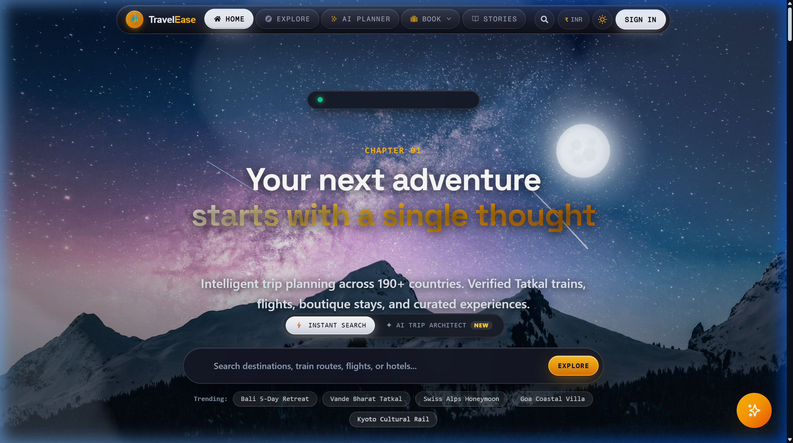
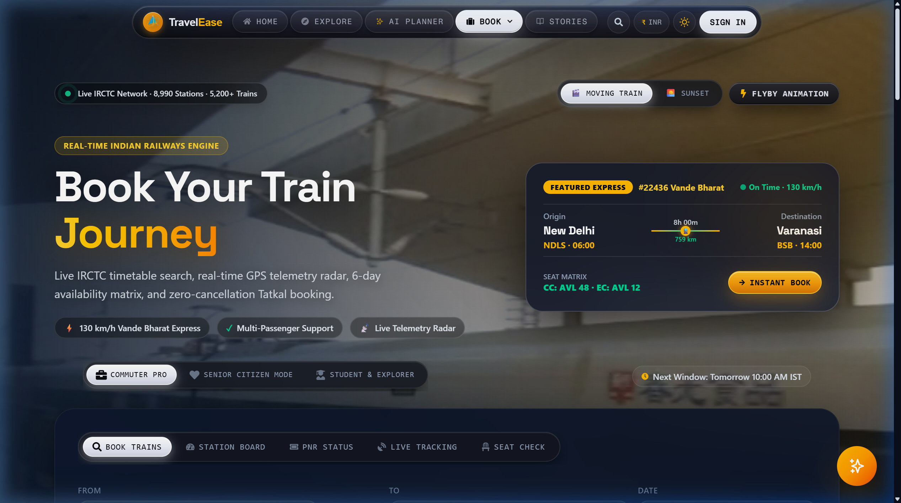
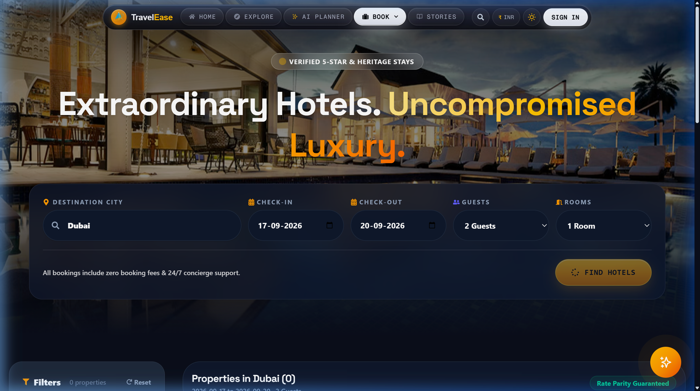
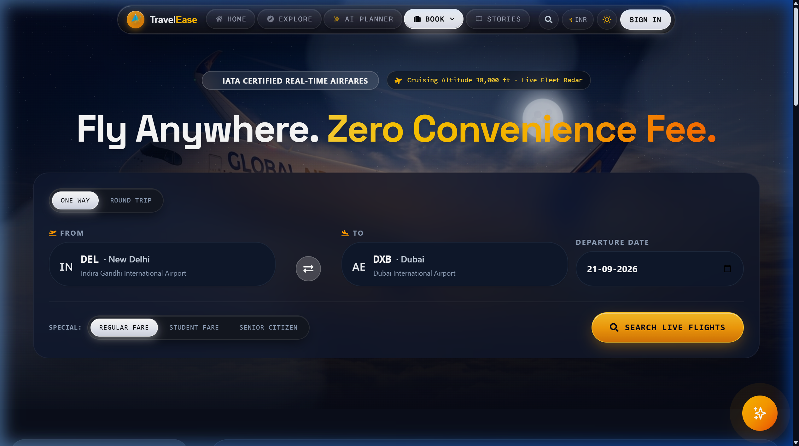
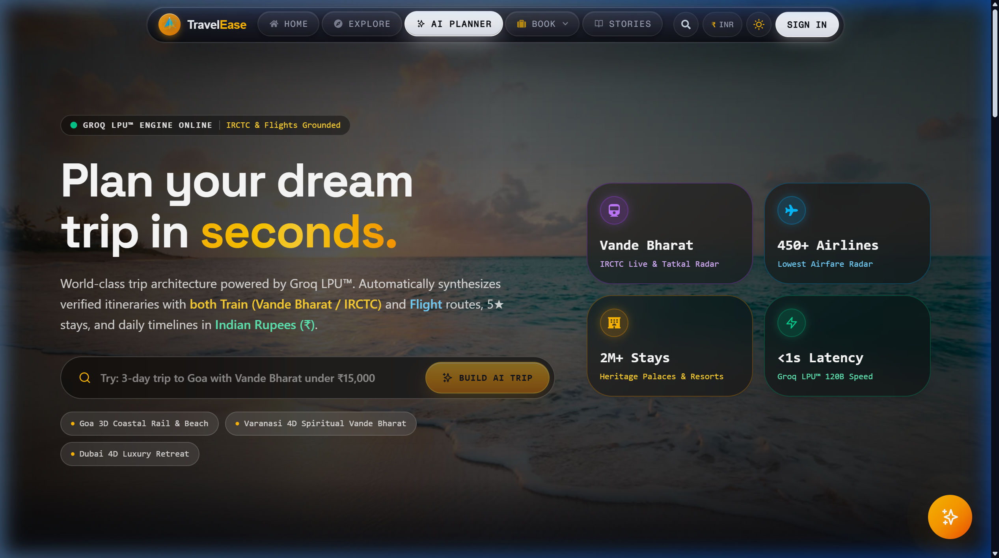

# TravelEase — Next-Gen Multi-Modal Travel Platform


> **The all-in-one travel operating system.**  
> TravelEase unifies pan-India train tracking across 8,990+ stations, international flight booking, boutique stays with interactive maps, and AI-powered trip planning into a single, seamless platform.

[🚀 Quick Start](#-how-to-run-locally-3-simple-steps) • [📸 Screenshots](#-the-platform-in-action) • [💡 Why TravelEase?](#-why-travelease) • [🏛️ Architecture](ARCHITECTURE.md) • [🔒 Security](SECURITY.md) • [🤝 Contributing](CONTRIBUTING.md)

---

## 📸 The Platform in Action

Here is what TravelEase looks like when running locally, showing real routes, live train telemetry, and real pricing data:

---

### 1. Home Dashboard & 3D Celestial Experience



* **3D Celestial Hero:** Immersive night sky hero with interactive stars and mountain landscapes.
* **Smart Search Bar:** Instant autocomplete across destinations, train numbers, flight routes, and hotels.
* **Trending Expeditions:** One-click search chips for popular trips (*Bali 5-Day Retreat*, *Vande Bharat Tatkal*, *Swiss Alps Honeymoon*, *Goa Coastal Villa*, *Kyoto Cultural Rail*).
* **Multi-Currency Switcher:** Toggle prices in real-time between Indian Rupee (**₹ INR**), US Dollar (**$ USD**), Euro (**€ EUR**), and UAE Dirham (**د.إ AED**).
* **Mac-Style Floating Dock:** Smooth top navigation bar with proximity magnification.

---

### 2. Pan-India Rail Hub (IRCTC & Indian Railways)



* **Massive Rail Network:** Live schedules covering **8,990+ railway stations** and **5,200+ trains**.
* **Featured Express:** Live route telemetry for **#22436 Vande Bharat Express** (New Delhi `NDLS` 06:00 to Varanasi `BSB` 14:00, 759 km in 8 hours at 130 km/h).
* **Real-Time Seat Availability:** Live seat counts for Executive Chair Car (`EC: AVL 12`) and Chair Car (`CC: AVL 48`).
* **Tatkal Countdown Assistant:** Live indicator alerting travelers to the next 10:00 AM IST AC Tatkal booking window.
* **Integrated Rail Tools:** Quick tabs for Station Live Boards, PNR Confirmation Status, and Live GPS Train Running Status.
* **Commuter Personas:** Filter trains specifically for daily commuters, senior citizens, or students.

---

### 3. Sanctuary Stays & Interactive Maps



* **Verified Luxury & Heritage Stays:** Search hotels, resorts, and homestays across major destinations (Dubai, Varanasi, Goa, Jaipur, Delhi, and more).
* **Interactive Leaflet Map:** Precise GPS map pins showing hotel locations, nearby landmarks, and prices.
* **Flexible Filters:** Filter by check-in and check-out dates, guest count, room count, and price slabs.
* **Rate Parity Guarantee:** Direct rates with zero hidden booking fees and 24/7 concierge support.

---

### 4. Global Flight Radar



* **Direct Route Queries:** Instant non-stop and connecting route search between international hubs (e.g. `DEL` New Delhi to `DXB` Dubai).
* **Zero Hidden Convenience Fees:** Authoritative base pricing with clear tax and fee breakdowns.
* **Special Passenger Fares:** Dedicated fare toggles for Regular, Student, and Senior Citizen discounts.
* **Round-Trip Multipliers:** Bundled round-trip savings calculated automatically on the server.

---

### 5. AI Trip Architect



* **Instant Multi-Day Plans:** Sub-second itinerary generator that crafts day-by-day travel blueprints in Indian Rupees (`₹`).
* **Multi-Modal Integration:** Combines high-speed rail (*Vande Bharat*), flights, 5-star heritage stays, and local transit into one itinerary.
* **Pre-Loaded Trip Templates:**
  * *"3-day trip to Goa with Vande Bharat under ₹15,000"*
  * *"Varanasi 4-Day Spiritual Rail & Ghats Tour"*
  * *"Dubai 4-Day Luxury Retreat"*
* **Comprehensive Metrics:** Live metrics across 450+ airlines, 2M+ stays, and verified IRCTC schedules.

---

## 💡 Why TravelEase?

1. **No More 5-Tab Chaos:** Most travelers juggle IRCTC for trains, Google Flights for airfare, Booking.com for hotels, and notes apps for itineraries. TravelEase brings all of them into a single, cohesive dashboard.
2. **Works Out of the Box:** You do **not** need to buy expensive third-party API keys to explore this repository. The project includes built-in offline heuristic engines and station datasets so all searches, train schedules, hotel maps, and itinerary flows work immediately.
3. **Zero-Trust Pricing Security:** Prices are calculated and cryptographically signed on the server with HMAC-SHA256 tokens. The client browser can never tamper with fares before checkout.
4. **Clean Code & Modern Stack:** Built with React 19, Tailwind CSS v4, Express, and Leaflet Maps, following clean component patterns and modular service layers.

---

## 🛠️ Technology Stack

* **Frontend:** React 19, Vite 7, React Router v7
* **Styling & Effects:** Tailwind CSS v4, Framer Motion, Three.js (3D Celestial Canvas)
* **Maps & GIS:** Leaflet, React-Leaflet
* **Backend:** Node.js (v20), Express 4 (ES Modules)
* **Database:** MongoDB via Mongoose 8
* **Security:** Cryptographic HMAC-SHA256 quote verification, Helmet, NoSQL sanitization
* **Testing:** Custom test suite covering security, quote tokens, and tax slabs

---

## 🏛️ System Architecture

TravelEase is built on an **offline-first, zero-trust dual-mode architecture** that seamlessly unifies live travel APIs with intelligent local fallback engines:

* **Client Presentation Layer (React 19 & Vite 7):**  
  A modern Single Page Application powered by Tailwind CSS v4 and Framer Motion micro-interactions. Features an interactive Three.js celestial canvas, smooth Mac-style top navigation dock, and Leaflet GPS maps. Global state is cleanly managed via dedicated context providers for Authentication, Active Bookings, Currency Conversion, and Dark/Light theming.

* **Network & Security Gateway (Express 4):**  
  All network traffic is safeguarded by strict Helmet Content Security Policies (CSP), domain-verified CORS boundaries, auth rate limiting, and deep recursive input sanitization that strips NoSQL operators (`$gt`, `$where`) and prototype pollution vectors (`__proto__`).

* **Authoritative Application Tier (Node.js 20):**  
  Modular service controllers handle flights, stays, pan-India rail transit, and AI itinerary generation. Crucially, a server-side HMAC-SHA256 pricing engine signs all checkout quotes with tamper-proof cryptographic tokens, guaranteeing financial integrity.

* **Self-Healing Resilience Engine (Zero-Config Mode):**  
  When external third-party API keys are not supplied, the platform automatically switches to built-in offline catalogs—indexing **8,990+ Indian Railway stations**, 5,200+ train schedules, dynamic flight routes, and curated boutique hotel coordinates.

* **Persistence Layer (MongoDB & Mongoose 8):**  
  Manages user authentication, reservation records, and webhook logs with automatic retry resilience and dual IPv4/IPv6 resolution.

> 📖 **Detailed Architectural Blueprint:** For low-level sequence diagrams, entity relationship diagrams, and mathematical pricing models, see [ARCHITECTURE.md](ARCHITECTURE.md).

---

## 🚀 How to Run Locally (3 Simple Steps)

### Prerequisites
Make sure you have **Node.js** (v18 or v20) installed on your computer.

---

### Step 1: Clone the Repository

```bash
git clone https://github.com/your-username/travelease.git
cd travelease
```

---

### Step 2: Start the Frontend

Open your terminal in the project root folder:

```bash
# Install dependencies
npm install

# Copy configuration template
cp .env.example .env

# Start the frontend
npm run dev
```

Open your browser and visit: **`http://localhost:5173`**

---

### Step 3: Start the Backend

Open a second terminal window:

```bash
# Navigate to server directory
cd server

# Install dependencies
npm install

# Copy configuration template
cp .env.example .env

# Start the backend
npm run dev
```

The backend API is now running at: **`http://localhost:5000`**

> **Note:** MongoDB is optional for local development. If MongoDB is not running, the server continues gracefully using the built-in offline catalog.

---

## 🧪 Running Automated Tests

Run the test suite from the root folder:

```bash
npm test
```

This verifies input sanitization, prototype pollution defense, tax calculations, and cryptographic quote signing. All 18 tests execute locally without needing any internet connection.

---

## 📁 Repository Organization

```text
Travel-website-main/
├── docs/
│   ├── brand/               # Vector SVG logos (light, dark, brand marks)
│   └── screenshots/         # Real in-app UI screenshots
├── src/
│   ├── components/          # Reusable UI (Header, Footer, Floating Dock, 3D Hero)
│   ├── context/             # App state (Auth, Bookings, Currency, Theme)
│   ├── data/                # Offline fallback datasets & station master
│   ├── features/            # Feature modules (Flights, Hotels)
│   ├── pages/               # Page views (Home, Trains, Hotels, Flights, AI Planner)
│   ├── services/            # API clients, fallback data engines, payments
│   └── index.css            # Tailwind design system & global styles
├── server/
│   ├── src/
│   │   ├── models/          # Database schemas
│   │   ├── routes/          # API route controllers
│   │   └── services/        # Backend business logic & HMAC signer
│   └── index.js             # Server entry point
├── tests/                   # Automated security and flow tests
├── ARCHITECTURE.md          # Detailed engineering & system topology guide
└── README.md                # Project overview and visual guide
```

---

## 📄 License

This project is licensed under the [MIT License](LICENSE). Feel free to use it for learning, personal projects, or building your own travel applications!
